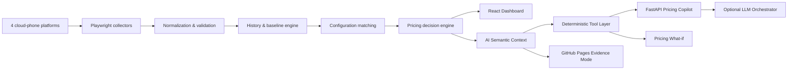

# Cloud Phone Pricing Intelligence Platform

**AI-powered competitive pricing monitoring and decision-support system**

Live Dashboard: https://nikolaustis.github.io/Cloud-Phone-Price-Dashboard-Site/

## Product problem

Cloud-phone packages cannot be compared reliably by plan name alone. Configurations, Android versions, purchase durations, subscription modes, regions and promotions differ across platforms. The project therefore combines collection, normalization, configuration matching, historical state semantics, pricing rules and evidence-grounded AI decision support.

## Portfolio architecture

## AI engineering choices

- structured numeric queries use deterministic tools rather than RAG;
- stable fact/evidence IDs make answers auditable;
- What-if calculations happen in code;
- LLM provider is abstracted from pricing logic;
- public GitHub Pages keeps an API-key-free Evidence Mode;
- a synthetic demo dataset makes the AI layer reproducible without collector credentials;
- evaluation begins with the tool layer and later extends to production LLM grounding, latency and cost.

## Recommended resume wording after production evaluation

> **云手机竞品价格智能监测与 AI 决策平台｜独立项目**  
> 基于 Python、Playwright、React、FastAPI 搭建覆盖 4 个云手机平台的端到端价格情报系统，实现采集、标准化、跨平台配置配对、历史趋势监测与 Dashboard 可视化；设计配置相似度、竞品中位价及相对价格指数等决策指标，并显式区分实时观测、历史沿用与缺失数据。基于结构化语义层构建 AI Pricing Copilot，通过 Tool Calling 完成自然语言价格查询、可解释配置分析与 What-if 调价模拟，输出带 fact/evidence ID 与数据 revision 的可追溯结果；建立 AI Evaluation 框架评估数值准确率、证据覆盖率、拒答正确率、延迟与成本。

Only replace the final clause with measured production metrics after running a real safe-data benchmark.
